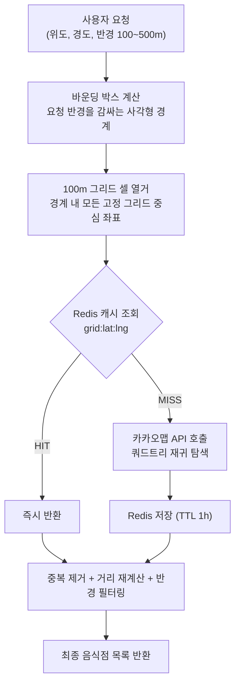

> [!NOTE]
> 해당 프로젝트의 주요 역할 및 트러블 슈팅을 정리하기 위한 요약본입니다.
>
> 전체적인 정보를 위해 원본을 보고 싶으시다면 [FoodFinder](https://github.com/20250918-beyond-SW-Camp-21th/beyond-SW-21th-third-3team)를 클릭해주세요.

---

## 핵심 성과

> 카카오맵 API의 45건 조회 제한을 **쿼드트리 재귀 탐색 + Redis 그리드 캐싱**으로 해결
> 밀집 상권 기준 API 호출량 **96.2% 감소**, 응답속도 **98.2% 개선**

| 항목 | 캐시 없음 | 캐싱 적용 후 | 개선율 |
|------|-----------|------------|--------|
| API 호출 (강남역 500m, 100명) | 11,992회 | 458회 | **96.2%↓** |
| 응답시간 | 1,786,803ms (약 29.8분) | 32,525ms (약 32.5초) | **98.2%↓** |
| 예상 비용 | 1,199.2원 | 45.8원 | **96.2%↓** |

---

## 목차

1. [프로젝트 개요](#1-프로젝트-개요)
2. [아키텍처](#2-아키텍처)
3. [트러블 슈팅](#3-트러블-슈팅)

---

## 1. 프로젝트 개요


> 인원: 5명 (백엔드 5) · 기간: 2025.12.19 ~ 2026.01.05 (2주)

**FoodFinder**는 사용자의 취향과 현재 위치를 기반으로 AI가 최적의 음식점을 추천해주는 서비스입니다.

사용자가 선택한 해시태그(분위기, 음식 종류, 상황 등)와 위치 정보를 분석하여 카카오맵 API로 주변 음식점을 검색하고, OpenAI GPT-4o를 활용해 개인 맞춤형 음식점을 추천합니다.

**주요 담당 역할:** 카카오맵 API 기반 주변 음식점 전체 조회 + Redis 그리드 캐싱

---

## 2. 아키텍처



**핵심 설계: 전략 패턴**

`RestaurantFinder` 인터페이스를 `KakaoMapRestaurantFinder`(실제 API 호출)와 `CachedRestaurantFinder`(`@Primary`, Redis 래퍼)가 구현합니다. 캐싱 레이어가 호출부에 투명하게 끼워지므로, 서비스 코드 변경 없이 캐싱 전략만 교체하거나 테스트 시 Mock으로 대체할 수 있습니다.

---

## 3. 트러블 슈팅

### 3-1. 카카오맵 API 조회 제한 문제

카카오맵 API는 한 번의 검색에 최대 45건(15건 × 3페이지)만 반환합니다. 반경 300m 이상에서는 수백 개의 음식점이 존재할 수 있어 전체 조회가 불가능합니다.


**해결: 쿼드트리 기반 재귀 탐색**

검색 영역을 4등분하며 재귀 탐색합니다. 한 셀에 45건 이상이면 다시 4분할하고, 100m 셀까지 줄어도 45건을 초과하면 결과를 그대로 수집합니다.


```java
// KakaoMapRestaurantFinder.java
private void searchByRectangleRecursive(
        Double latitude, Double longitude,
        RectangleBounds bounds, Map<String, Restaurant> restaurants, int size) {

    KakaoPlaceResponse response = searchByRectangle(latitude, longitude, bounds);

    if (response.meta().canFetch()) {           // 45건 이하 → 전체 수집
        searchByRectangleRestaurants(latitude, longitude, bounds)
                .forEach(r -> restaurants.putIfAbsent(r.id(), r));
        return;
    }
    if (response.meta().isEmpty()) return;      // 결과 없음 → 종료

    if (size < KakaoMapConstance.MIN_SUBDIVISION_CELL_SIZE) {  // 100m 한계 → 강제 수집
        searchByRectangleRestaurants(latitude, longitude, bounds)
                .forEach(r -> restaurants.putIfAbsent(r.id(), r));
        return;
    }

    RectangleBounds[] subRectangles = CoordinateUtils.subdivideRectangle(bounds);  // 4분할
    for (RectangleBounds subRect : subRectangles) {
        searchByRectangleRecursive(latitude, longitude, subRect, restaurants, size / 2);
    }
}
```

모든 음식점을 조회할 수 있었지만, 재귀 탐색으로 인해 API 호출량과 응답시간이 크게 증가하는 새로운 문제가 발생했습니다.


---

### 3-2. Redis 캐싱 아키텍처 선택 이유

API 호출량 증가는 비용 문제로, 느린 응답시간은 사용자 경험 문제로 직결됩니다.
핵심 문제가 "높은 API 호출 횟수와 느린 응답속도"였기 때문에 두 가지 방안을 검토했습니다.

| 방안 | 장점 | 단점 | 선택 |
|------|------|------|:----:|
| 공공데이터 API + PostgreSQL + 일별 스케줄링 | 외부 API 의존 제거, 빠른 조회 | 음식점 데이터 직접 관리로 복잡성 과도 증가 | ❌ |
| Redis 캐싱 | 기존 구조 유지, 반복 요청 비용 직접 절감 | 캐시 만료 시 재호출 필요 | ✅ |

직접 데이터를 관리하는 방식은 2주 프로젝트 규모 대비 운영 복잡성이 과도하다고 판단했고, 문제의 본질이 "반복되는 동일 구역 요청"이었기 때문에 캐싱이 가장 직접적인 해결책이라 결론지었습니다.

---

### 3-3. 그리드 기반 캐싱으로 API 호출량 96% 감소

**설계:** 검색 반경을 커버하는 바운딩 박스를 **100m 고정 그리드**로 분할하고, 각 셀의 중심 좌표(스냅된 위도·경도)를 Redis 키로 사용합니다.

```java
// CachedRestaurantFinder.java
String key = "grid:%f:%f".formatted(cellLat, cellLng);
```

그리드 중심 좌표는 아래 공식으로 지구 곡률을 고려해 계산합니다.

```java
// CoordinateUtils.java
public static List<double[]> enumerateGridCells(RectangleBounds bounds, int gridSizeMeters) {
    double latStep = gridSizeMeters / METERS_PER_DEGREE_LAT;          // 위도 100m 간격

    for (double cellLat = startLat; cellLat <= endLat; cellLat += latStep) {
        double snappedLat = Math.round(cellLat / latStep) * latStep;   // 그리드에 스냅
        // 경도 간격은 위도에 따라 달라지므로 cos(lat) 보정
        double lngStep = gridSizeMeters / (METERS_PER_DEGREE_LAT * Math.cos(Math.toRadians(snappedLat)));

        for (double cellLng = startLng; cellLng <= endLng; cellLng += lngStep) {
            double snappedLng = Math.round(cellLng / lngStep) * lngStep;
            cells.add(new double[]{snappedLat, snappedLng});
        }
    }
    return cells;
}
```

동일 그리드 요청 시 캐시에서 즉시 반환하고, MISS인 경우에만 카카오맵 API를 호출 후 결과를 저장합니다. TTL은 1시간으로 설정했는데, 음식점 데이터는 수 시간 단위로 변경되지 않으므로 정합성보다 비용 절감을 우선한 트레이드오프입니다.


**결과 (강남역 500m, 100명 시뮬레이션):**

| 항목 | 캐시 없음 | 셀 캐싱 | 개선율 |
|------|-----------|---------|--------|
| API 호출 | 11,992회 | 458회 | **96.2%↓** |
| 소요시간 | 1,786,803ms | 32,525ms | **98.2%↓** |
| 예상 비용 | 1,199.2원 | 45.8원 | **96.2%↓** |

같은 위치에서의 반복 요청(캐시 HIT) 비교:


---

### 3-4. 저밀도 지역의 캐싱 효율 저하 (개선 계획)

밀집도가 낮은 지역에서는 음식점이 100m 셀 한 개에 몰리지 않고 넓게 분산되어 있어 캐시 HIT율이 낮습니다.

| 항목 | 캐시 없음 | 셀 캐싱 | 절감 |
|------|-----------|---------|------|
| API 호출 | 1,548회 | 1,103회 | **28.7%↓** |
| 소요시간 | 87,100ms | 63,867ms | **26.7%↓** |
| 예상 비용 | 154.8원 | 110.3원 | **28.7%↓** |

밀집 상권 대비 효과가 제한적입니다. 향후 인접 셀을 병합하는 **동적 그리드 병합** 방식을 적용해 저밀도 지역의 캐시 재사용률을 높이는 방향을 계획하고 있습니다.